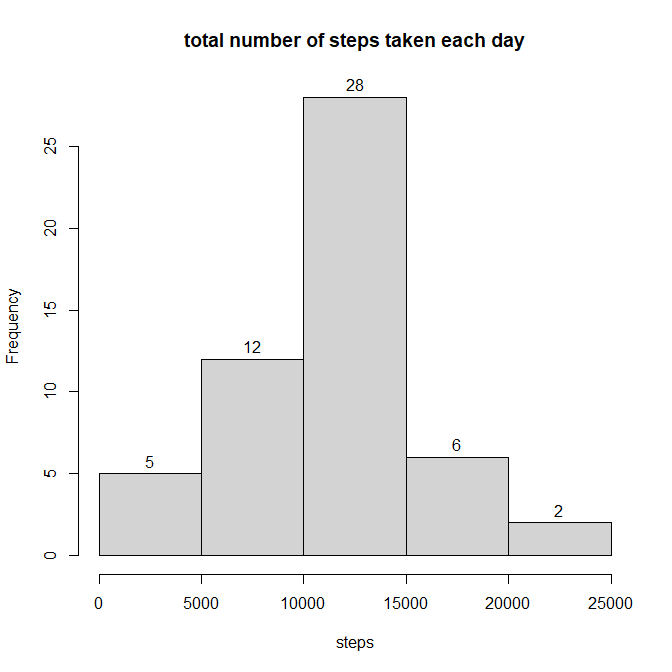
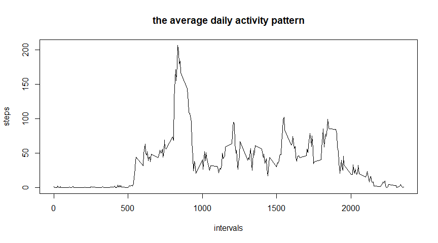
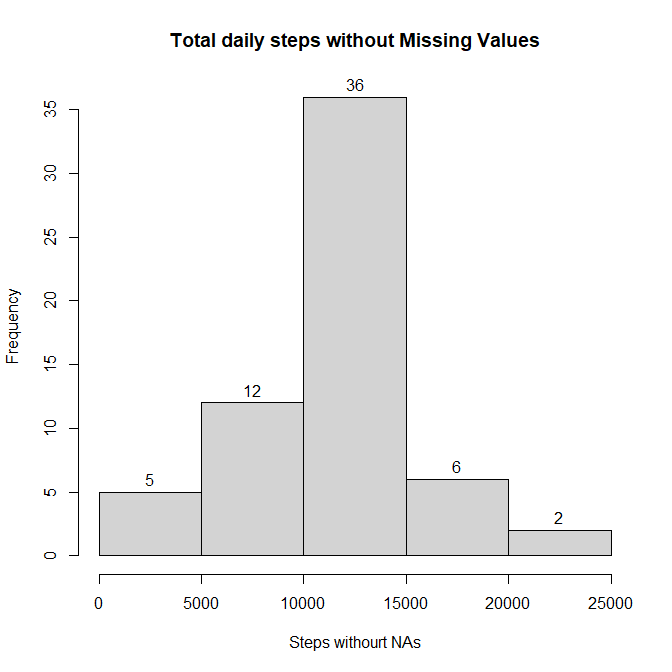
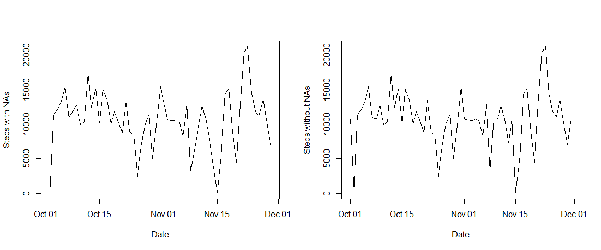
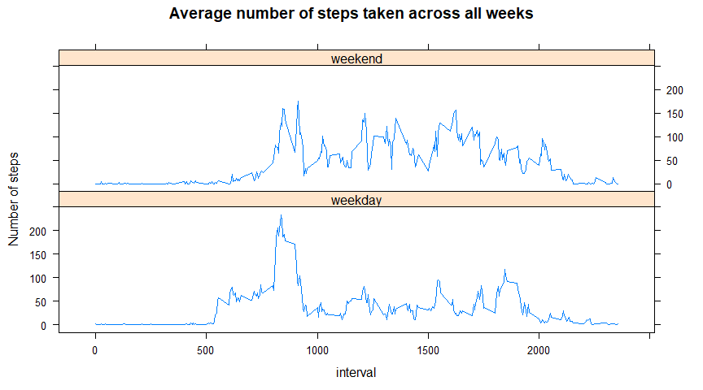

## Loading and preprocessing the data


```r
unzip("activity.zip")
activity  <- read.csv("activity.csv")
str(activity)
```

```
## 'data.frame':	17568 obs. of  3 variables:
##  $ steps   : int  NA NA NA NA NA NA NA NA NA NA ...
##  $ date    : chr  "2012-10-01" "2012-10-01" "2012-10-01" "2012-10-01" ...
##  $ interval: int  0 5 10 15 20 25 30 35 40 45 ...
```

```r
### Converting activity$date column into date format
activity$date <- as.Date(activity$date,"%Y-%m-%d")
str(activity)
```

```
## 'data.frame':	17568 obs. of  3 variables:
##  $ steps   : int  NA NA NA NA NA NA NA NA NA NA ...
##  $ date    : Date, format: "2012-10-01" "2012-10-01" ...
##  $ interval: int  0 5 10 15 20 25 30 35 40 45 ...
```

## What is mean total number of steps taken per day?


```r
total_daily_steps <- aggregate(steps~date,activity,sum)
head(total_daily_steps)
```

```
##         date steps
## 1 2012-10-02   126
## 2 2012-10-03 11352
## 3 2012-10-04 12116
## 4 2012-10-05 13294
## 5 2012-10-06 15420
## 6 2012-10-07 11015
```

```r
hist(total_daily_steps$steps,xlab= "steps", main = "total number of steps taken each day",labels = TRUE)
```

<!-- -->

### Mean and Median of the dataset

```r
mean(total_daily_steps$steps, na.rm = TRUE)
```

```
## [1] 10766.19
```

```r
median(total_daily_steps$steps, na.rm=TRUE)
```

```
## [1] 10765
```

## What is the average daily activity pattern?

```r
avg_daily_steps <- aggregate(steps~interval,activity,mean)
head(avg_daily_steps)
```

```
##   interval     steps
## 1        0 1.7169811
## 2        5 0.3396226
## 3       10 0.1320755
## 4       15 0.1509434
## 5       20 0.0754717
## 6       25 2.0943396
```

```r
plot(avg_daily_steps$interval,avg_daily_steps$steps,type = "l",xlab = "intervals",ylab = "steps",main = "the average daily activity pattern")
```

<!-- -->

### Maximum steps in an interval


```r
avg_daily_steps[which(avg_daily_steps$steps == max(avg_daily_steps$steps)),]
```

```
##     interval    steps
## 104      835 206.1698
```


## Imputing missing values
### Number of NAs

```r
sum(is.na(activity))
```

```
## [1] 2304
```

### Creating a new dataset

```r
new_activity <- activity
```

### Imputing Missing values
For imputing missing figures, my strategy is to replace `NAs` in particular interval with its mean for example `interval == 0` has a mean of `1.7` and has 8 `NAs`. This `NAs` to be replaced with `1.7`. The reason for doing so is as there are certain hour in a day which are quite active such as morning runs, going to work,college or school,playing and there are some hours which are not so such as sleeping, eating, reading, watching. These activities on average tend to have same timing each day

```r
### creating a loop to iterate each interval
### numeric(unique(new_activity$interval)) creates a numeric vector containing each interval
### using which(new_activity$interval==i & new_activity$steps %in% new_activity[is.na(new_activity)]) to extract intervals where steps are missing
### then extracting rows and steps column which will give the total NAs value
### mean(new_activity[which(new_activity$interval == i),]$steps,na.rm = TRUE)} calculates mean and assign them to the missing values

for (i in as.numeric(unique(new_activity$interval))) {new_activity[which(new_activity$interval==i & new_activity$steps %in% new_activity[is.na(new_activity)]),]$steps <- mean(new_activity[which(new_activity$interval == i),]$steps,na.rm = TRUE)}

str(new_activity)
```

```
## 'data.frame':	17568 obs. of  3 variables:
##  $ steps   : num  1.717 0.3396 0.1321 0.1509 0.0755 ...
##  $ date    : Date, format: "2012-10-01" "2012-10-01" ...
##  $ interval: int  0 5 10 15 20 25 30 35 40 45 ...
```

```r
sum(is.na(new_activity))
```

```
## [1] 0
```
 
### Plotting new dataset

```r
new_total_daily_steps  <- aggregate(steps~date,new_activity,sum)
head(new_total_daily_steps)
```

```
##         date    steps
## 1 2012-10-01 10766.19
## 2 2012-10-02   126.00
## 3 2012-10-03 11352.00
## 4 2012-10-04 12116.00
## 5 2012-10-05 13294.00
## 6 2012-10-06 15420.00
```

```r
hist(new_total_daily_steps$steps,labels = TRUE,xlab="Steps withourt NAs",main = "Total daily steps without Missing Values")
```

<!-- -->

### Mean and Median of the new dataset

```r
mean(new_total_daily_steps$steps)
```

```
## [1] 10766.19
```

```r
median(new_total_daily_steps$steps)
```

```
## [1] 10766.19
```


### Comparing two data sets

```r
par(mfrow=c(1,2))
plot(total_daily_steps$date,total_daily_steps$steps,type = "l",xlab="Date",ylab="Steps with NAs")
abline(h=mean(total_daily_steps$steps))
plot(new_total_daily_steps$date,new_total_daily_steps$steps,type = "l",xlab = "Date",ylab="Steps without NAs")
abline(h=mean(new_total_daily_steps$steps))
```

<!-- -->
After imputing missing value the new dataset is not much so different then the original dataset
## Are there differences in activity patterns between weekdays and weekends

```r
### creating new column day 

activity$day <- weekdays(activity$date)

### separating weekday and weekend rows

wkd <- grep("(Monday|Tuesday|Wednesday|Thursday|Friday)",activity$day)
wkn <- grep("(Saturday|Sunday)",activity$day)

### adding a new column week and inserting the respective value

activity[wkd,"week"] <- "weekday"
activity[wkn,"week"] <- "weekend"

head(activity)
```

```
##   steps       date interval    day    week
## 1    NA 2012-10-01        0 Monday weekday
## 2    NA 2012-10-01        5 Monday weekday
## 3    NA 2012-10-01       10 Monday weekday
## 4    NA 2012-10-01       15 Monday weekday
## 5    NA 2012-10-01       20 Monday weekday
## 6    NA 2012-10-01       25 Monday weekday
```

```r
library(lattice)

### creating a new data frame with avg steps across each interval in a week
avg_Week_steps <- aggregate(steps~interval+week,data = activity,mean)


xyplot(steps~interval|week,avg_Week_steps,type="l",layout=c(1,2),ylab="Number of steps",main="Average number of steps taken across all weeks")
```

<!-- -->


